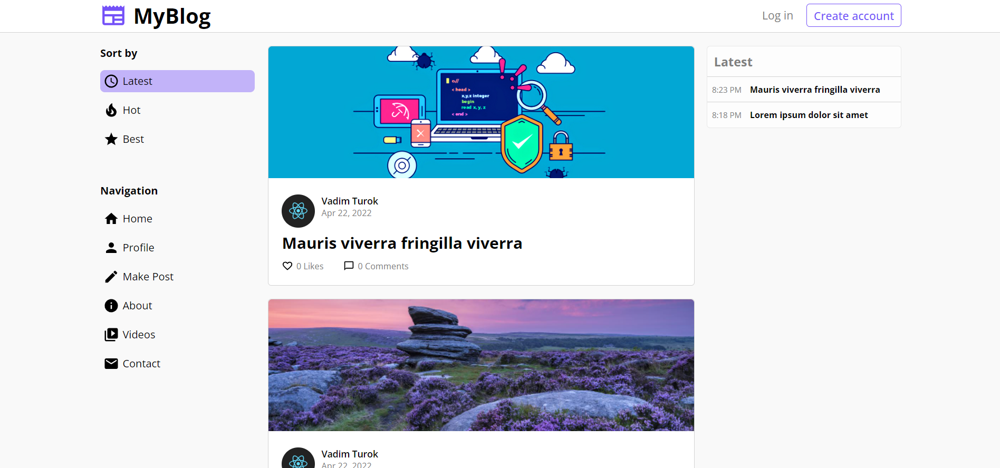

# 📝MyBlog - blog application
> MyBlog is a simple blog application where users
> able to create their own posts, react to other's posts and many more.
> Live demo
>  [_here_](https://deploy-nest-react-blog-app.herokuapp.com/). <!-- If you have the project hosted somewhere, include the link here. -->

## Table of Contents
* [Technologies Used](#technologies-used)
* [Features](#features)
* [Screenshots](#screenshots)
* [Setup](#setup)
* [Project Status](#project-status)
* [Contact](#contact)
<!-- * [License](#license) -->


## Technologies Used
- React - version 18.0.0
- Moment - version 2.29.3
- Redux - version 4.1.2
- TypeScript - version 4.6.3
- Axios - version 0.26.1
- SCSS - version 0.2.4
- Nest - version 8.0.0
- JWT - version 8.5.1
- PostgreSQL(pg) - version 8.7.3
- class-validator -  version 0.13.2
- TypeORM - version 0.2.45


## Features
Main features of the app:
- Viewing posts
- Viewing single post
- Viewing latest posts
- Creating posts
- Ordering post by time, likes or comments
- Writing comments
- Authorization & authentication system
- Editing user info
- Viewing own posts


## Screenshots

<!-- If you have screenshots you'd like to share, include them here. -->


## Setup
To run back-end server: open 'blog-app' folder, create .development.env file and provide database credentials and specify port.

Run following commands:

```
npm install
npm run start:dev
```
To run React application: open 'client' folder

Run following commands:

```
npm install
npm start
```


## Project Status
Project is: _completed_


## Contact
Contact with me via e-mail: turokvadim2510@gmail.com or on Twitter: [Vadim Turok](https://twitter.com/stefanio228)


<!-- Optional -->
<!-- ## License -->
<!-- This project is open source and available under the [... License](). -->
